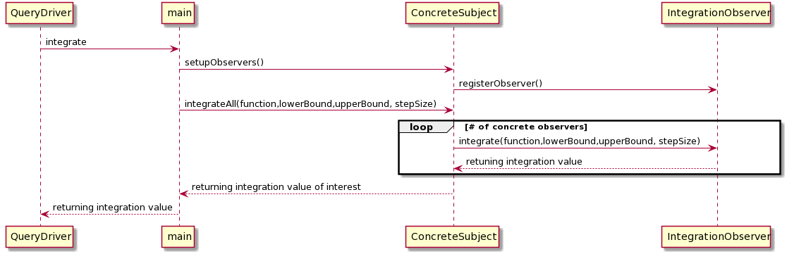

# CSSE374 Homework 2 - Part 1

## Strategy Pattern

Date: 4/22/2020

### Candidate Design 1: 

For candidate design 1, we should consider using the Strategy Pattern for the new interagration methods that are being provided to our system. We could create
a class, called IntegrationStrategy, which would replace the "integrationMethod" string that is currently passed into the integrate method function call. That way we could simply
call that IntegrationStrategy's integrate method, and it would call the appropriate strategy pattern to handle the proper integration.

#### Pros

This will eliminate having to check what type of integrationMethod that the integrationMethod String was (located in Integrate()).
Also, this apply's the principle of separating what changes from what stays the same. We know that the integration method will continue to change, so it makes
sense to extract out that behavior using the strategy pattern. Finally, this will allow our system to **adapt to change**, as we can add more implementations of
the IntegrationStrategy when the customer requests a new integration method.

#### Cons

Will require us to significantly change our integrate method, and how we are calling that method. This is because we are now passing in a strategy instead of a
 string to represent our actual integration methods. Also, applying this pattern will increase the coupling of our system.

### Candidate Design 2: 

For candidate design 2, we could try making the actual NumericalIntegration class a Strategy, and have the classes that implement the Strategy have their own
integrate function. This eliminate the need for the IntegrationMethod class, as NumericalIntegration classes would have different versions which would each
perform a different type of numerical intergration, such as derivates.

#### Pros

Could get rid of an entire class and just do the work in the NumericalIntegraiton strategies. Different strategies will have their own integrate methods and be
able to perform different forms of integration, per the customer. This will be useful if we want to extend the numerical integration to do different tasks.

#### Cons

This also may require **significant** change in the other parts of the system in order to properly adapt to removing an entire class. Additionally, this will mean
that we will have to move where the integration is being done, since now the NumericalIntegration class is responsible for doing the specific integration, and will
no longer have the integrate() method. This could lead to more design problems in the future. Additionally, consolidating this logic into NumericalIntegration
will lead to **lower cohersion**, which is very undesirable.

### Design Preference

I prefer candidate design 1. I believe it does a better job **separting what changes from what stays the same.** Additionally, I think it will be less of a hassle
for us to maintain, since all we would have to do is add another integration method strategy when the customer wants something else. **No other code will have
to change.** It is simple a matter of adjusting our initial program to be able to handle the strategy pattern instead of using strings to parse the integration
type.

### Class & Sequence Diagram Sketches

Class Diagram:

Sequence Diagram:

### Citations

https://sourcemaking.com/design_patterns/strategy

https://refactoring.guru/design-patterns/strategy

### Time Spent -- 2 hours

## Observer Pattern

Date: 4/23/2020

### Candidate Design 1

For the first candidate design, we could simply have the Integration class become a concrete subject that implements a subject interface, and then have
different integration methods register as observers and add them as subscribers to our Integration class. Our observer will have an integrate() method instead
of a update() method. Additionally, our subject will be able to add, remove, and integrateAll for all of its registered observers.

#### Pros

This does a very good job of **keeping our design loosely coupled.** Namely, it does this by completely isolating the integration methods' logic that we will be using
from the class that is calling those methods. Therefore, our system does a good job of separating what changes from what stays the same. The integrate methods will
implement the observer class which will require that they have a method to perform integration, which makes sense.

#### Cons

This seems like somewhat of an overkill. Everytime we call update(), or in this case integrate(), every single registered IntegrationMethod observer will perform their
integrate(). This means we are doing a lot of extra work if we only want to perform a single integration, since we are doing all the other integrations as well.

### Candidate Design 2

For the second candidate design, I propose we use the java observable API. With this design, integration methods that have registered as observers can push
their results to the calling observable class. Our calling call will need to implement Observable so it can aquire the needed functions.

#### Pros

We eliminate the overkill of the first design by pushing out results of specific integration method observers rather than computing all of the observers when
we call integrate().

#### Cons

Does not make use of favoring composition over inheritence, and therefore this will make it harder to adapt and change our software over time. This results in
an overall worse design. Additionally, if the java observable API ever becomes deprecated or unused, we will have to greatly change our design in order to
adjust.

### Design Preference

I prefer the first candidate design because it does a better job favoring composition over inheritence and will do a better job of handling changes in the future. Although there are a couple
flaws in the overkill of the funcion calls, it still will do what we want it to do. Also, the first design has a more loosely coupled design between the observers
and the subjects, which is an important principle when considering the observer pattern.

### Class & Sequence Diagram Sketches

Class Diagram:

Sequence Diagram:

### Citations

https://docs.oracle.com/javase/7/docs/api/java/util/Observable.html

https://sourcemaking.com/design_patterns/observer

https://www.baeldung.com/java-observer-pattern

### Time Spent -- 1.5 hours

## Final Selection

Date: 4/24/2020

### Revisit best Strategy & Observer Pattern Sketches

Strategy Pattern Class Diagram:

Strategy Pattern Sequence Diagram:

Observer Pattern Class Diagram:

Observer Pattern Sequence Diagram:

### Pros & Cons of Each

Strategy Pros: In my opinion, this class does the best job of separating what changes from what stays the same. It also does the best job of encapsulating the integration
algorithms of our system that will be subject to change via the client. It also allows for reuse, since all we need to do is create another IntegrationMethod
strategy class when we get new requirements. It also will execute the integrate() method of the strategy that we specify, and not all of the integrate() methods,
which is done in the observer pattern implementation.

Strategy Cons: There are more dependencies between classes in comparison to the Observer pattern's design, which means our design employs more coupling.

Observer Pros: Provides a very loosely coupled design where the ConcreteSubject that actually calls the integrate() method is largely separated from the
ConreteIntegrationObservers. Additionally, our design will also handle changes well; all we need to do is add more ConcreteIntegrationObservers when our
client requests more.

Observer Cons: You have to go through all of the observers and compute their integration values instead of being able to simply compute one integration value.
Additionally, I think the Strategy pattern is better for reuse, since for the observer pattern you not only need to create the new ConcreteObserver class, but you
also must then register that observer with the observers list in concrete subject.

### Preference

I prefer the strategy pattern approach. Overall, I believe it does a better job of **sperating what changes from what stays the same.**
It does this by encapuslating the integration algorithm into a strategy which can be implemented by several different client integration methods.
This will allow our code to have better resuse and help it **adapt to change** when new integration methods come in.

### Citations

1. http://fuchangmiao.blogspot.com/2007/10/strategy-vs-observer.html

2. https://neillmorgan.wordpress.com/2010/02/07/observer-pattern-pros-cons/

3. https://javadevcentral.com/strategy-design-pattern#Strategy_Pattern_%E2%80%93_Pros

4. https://javadevcentral.com/strategy-design-pattern#Strategy_Pattern_%E2%80%93_Cons (Same site but different section)

### Time Spent -- 1.5 hours